> # 2024.8

> ## Week 1（8.18）

> ### 2024.8.15
> [高数上](TextBook/上_高数.pdf) P16（PDF29）习题 P5（PDF12）

6；
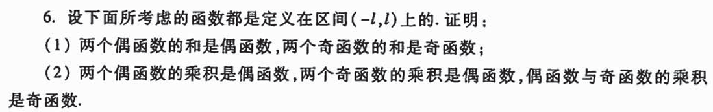
7(4)(5)(6)；
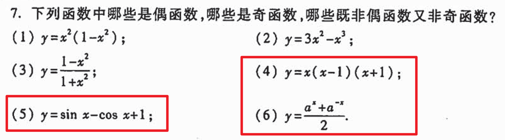
8；
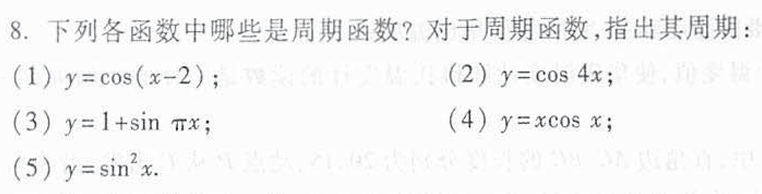
9(1)(2)(5)；
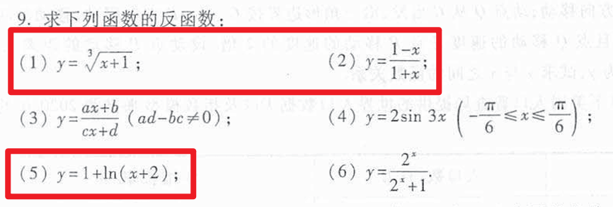
12；
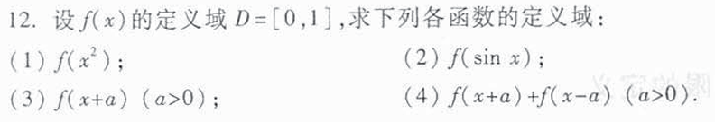
13;
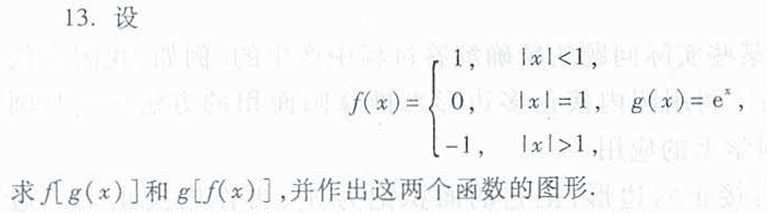

> ### 2024.8.16
> 高数上 P26（PDF39）习题 P12（PDF19）

2；
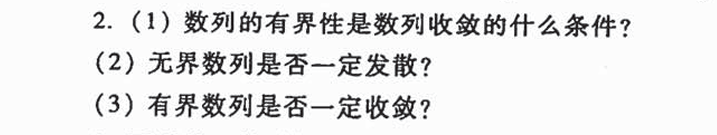
！3；
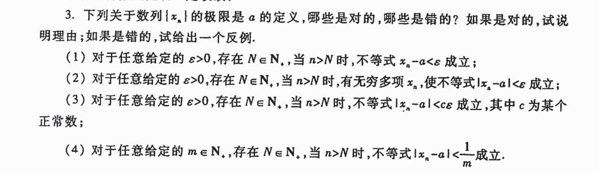
6；
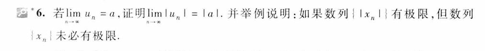
7；
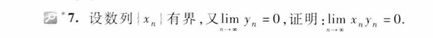
！8；

> ### 2024.8.17
> 高数上 P33（PDF46）习题 P17（PDF24）

4；
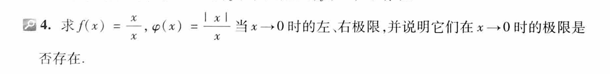
！11；
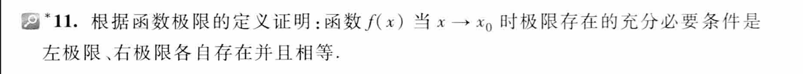
！12；

> ### 2024.8.18
> 高数上 P38（PDF51）习题 P22（PDF29）

6；
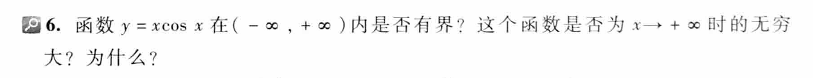
7；
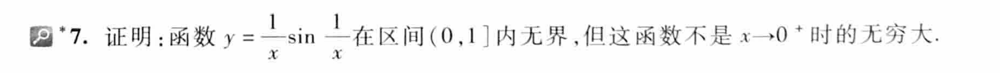
8；
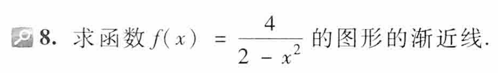

> ### 2024.8.27
> 高数上 P45（PDF58）习题 P23（PDF30）

1；(12)(13)(14)
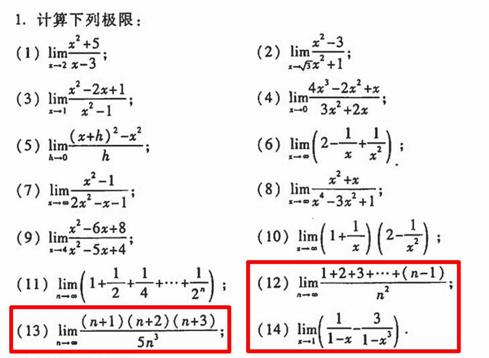
3；
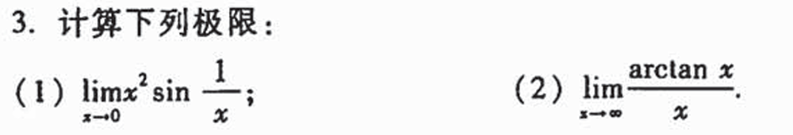
4；
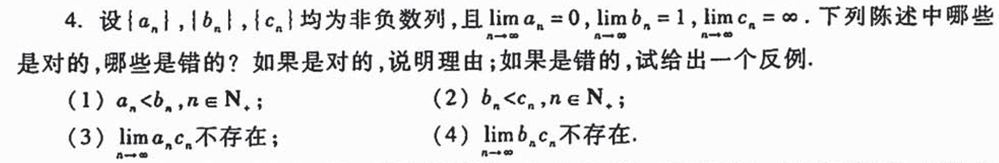
5；
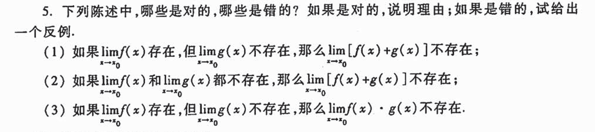

> ### 2024.8.29
> 高数上 P52（PDF）习题 P（PDF）

1；（4）（5）（6）

2；（2）（3）

4；（2）（3）（5）

本周小结：