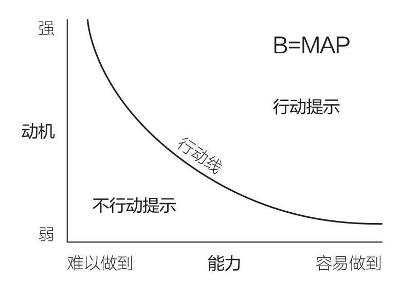
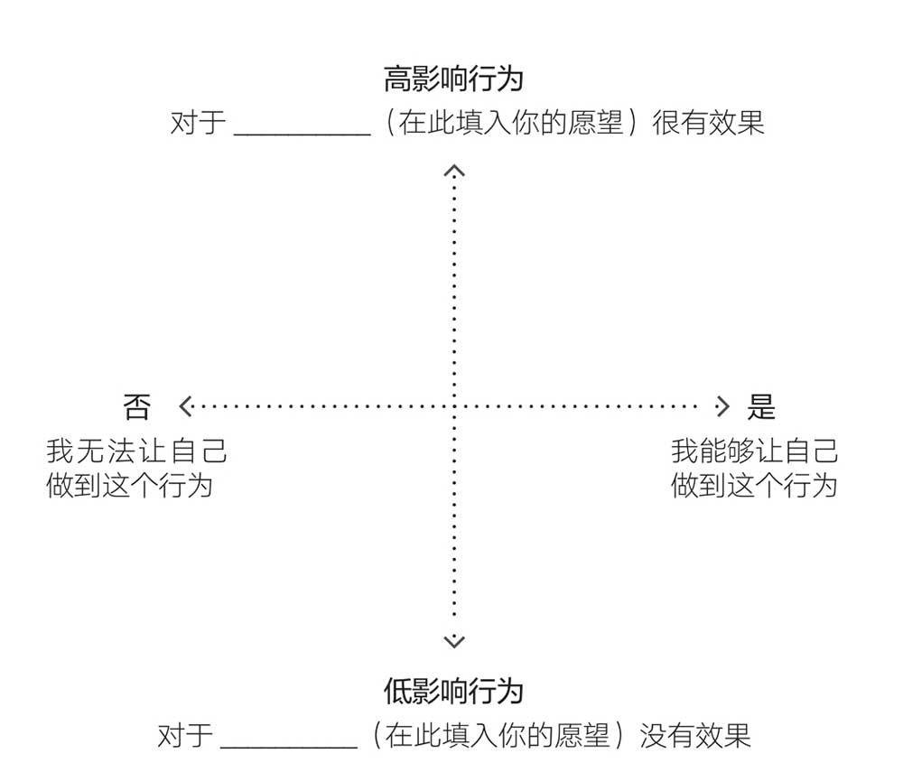

《福格行为模型》

**福格原则一，帮助人们做他们已经想做的事。**

# 一、影响行为的三大要素
>  **B = M & A & P**
> 行为(**B**ehavior) 发生于 动机(**M**otivation) 能力(**A**bility) 提示(**P**rompt) 

## 行为的三大要素
- 动机 动机越强越有可能**做到**。（我**为什么**要做？）
- 能力 越容易越有可能**成为习惯**。（我**做得到**吗？）
- 提示 没有提示的行为不会发生。（我应该**现在去**做吗？）

- 动机和能力共同影响行动线

>**行为：看书**
>- 动机——我想要取得进步、不看书期末就会挂科……
>- 能力——认识书上的字。
>- 提示——室友此刻都在看书。

## 解决行为问题的顺序
1. 提示
2. 能力
3. 动机

>**行为：迟到**
>- 提示——有没有及时通知？
>- 能力——是否有刚刚结束另一个会议或者身体不适？
>- 动机——大家是否有守时的观念？

## *TIPS
- 三大要素需要**同时满足**，缺一不可。
- 能成为习惯的行为（**不论好坏**）一定位于行动线右上方
- 不要**过度自责**，好习惯没有坚持下来并非完全因为你的意志力不足。

## *关键语句
`　　1. 你打算早上冥想，结果却没做，与其责怪自己缺少意志力或动力，不如逐一确认以下几个问题：有没有什么可以提示你？是什么让这件事变得难以做到？在多数情况下，有些行为难以做到的根本原因不是缺乏动机。只要找到一个好的提示，或是让行为更容易做到，就能解决行为问题。`

## *练习
- 练习1：探索终止习惯的方法
- 练习2：向别人讲授福格行为模型

# 动机
> - 动机不能直接激发行动

## 拥有动机却无法改变的几个原因
1. **动机很复杂** 容易因各方面影响发生变化。
   - 人物——我想做/不想做这件事。
   - 行动——如果我这么做/不这么做就会……
   - 情景——大家都这么做/希望我这么做。
2. **动机到达顶峰后会回落** 一鼓作气，再而衰，三而竭。
3. **动机可能指向抽象的概念** “我想要生活变得更好”——模糊的目标往往无法产生具体的行动。
4. **仅有动机无法实现长期改变** 动机是最不可靠和最不可预测的，只有动机而不考虑能力和提示无法产生改变。

## 行为设计的步骤（动机部分）
1. **明确愿望** 
2. **探索行为选项** **尽可能多**的写下**具体行动**
3. **匹配具体行为** 利用[**焦点地图**](#焦点地图)寻找**黄金行为**
   - **黄金行为** 能实现愿望、你想做、你能做的，位于焦点地图第Ｉ象限。
   - 误区：全凭猜测、生搬硬套……

### #焦点地图

1. **这个行为对你有多大的影响？** 暂时忽略行为的可行性和现实性。
2. **这个行为可行吗？现实吗？** 固定行为的影响，横向移动位置。

【！】
> **行为：**
> 明确愿望——
> 探索行为选项——
> 匹配具体行为——

## *关键语句
`　　1. 愿望是改变人生的绝佳起点。`

`　　2. 行为设计强调了这样一个事实：持久改变的关键，在于为自己匹配真心想做的行为。`

`　　3. 通过行为设计匹配的新习惯，是我们在最忙碌、最没动力且状态最不好时，也能做到的行为。如果你觉得自己在最累的时候也能做到这个行为，那它可能和你非常匹配，甚至是一个【黄金行为】。`

## *练习
- 练习1：找到黄金行为
- 练习2：通过焦点地图找到黄金行为

# 能力
> 让行为简单到随时都能做

## 行为设计的步骤（能力部分）
4. **从微习惯开始**

## “容易做”分析
- 能力链
  1. 时间
  2. 体力
  3. 资金
  4. 脑力
  5. 日程

> **行为：**
- 时间——
- 体力——
- 资金——
- 脑力——
- 日程——
