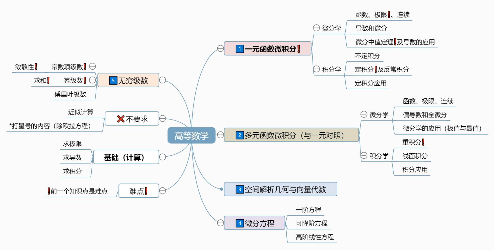

# 序

## 主要内容

[课程内容思维导图](图片/思维导图/课程内容.km)

---

# 函数 极限 连续

## 一、函数（对象）

### （一）函数的概念及常见函数

#### 1️⃣ 函数（定义）
   - **定义域**
   - 值域
   - **对应规则**
#### 2️⃣ 复合函数

#### 3️⃣ 反函数

> $y=(x)$ 的反函数 $x=f^{-1}(y)$ 等价于 $y=f^{-1}(x)$
- **充要条件：** $$\forall x_1\neq x_2 \in D, \rightarrow f(x_1)\neq f(x_2)\qquad\tag{函数为一一映射}$$
- **单调**函数一定有反函数，反之不然（充分不必要）
- $y=(x)$ 和 $y=f^{-1}(x)$ 关于 $y=x$ 对称

##### ⭕反函数的求解

1. 用$x$表示$y$
2. 用$y$表示$x$
3. 交换$x$和$y$

> **例：** 求 $y=x^3$ 的反函数
> 1. $y=x^3$ - （用$x$表示$y$）
> 2. $x=\sqrt[3]{y}$ - （用$y$表示$x$）
> 3. $y=\sqrt[3]{x}$ - （交换$x$和$y$）

#### 4️⃣ 初等函数

### （二）❗函数的性质

#### 2️⃣ 奇偶性

> **例：** 证明 $f(x)=ln(x+\sqrt{1+x^2})$ 是奇函数
> 显然 $f(x)=ln(x+\sqrt{1+x^2})$ 的定义域关于原点对称。由于
> $$ f(-x)=ln(-x+\sqrt{1+x^2})=ln\cfrac{1}{x+\sqrt{1+x^2}} \qquad(有理化)$$
> $$ =-ln(x+\sqrt{1+x^2})=-f(x), $$
> 故 $f(x)=ln(x+\sqrt{1+x^2})$是奇函数
>
> 此处利用了有理化，同乘 $x+\sqrt{1+x^2}$ 后利用平方差公式消去$-x+\sqrt{1+x^2}$

#### 3️⃣ 周期性

1. $sin\;x$，$cos\;x$ 周期$2\pi$；$sin\;2x$，$\vert sin\;x \vert$ 周期 $\pi$；
2. 若 $f(x)$ 以$T$为周期，则$f(ax+b)$以$\cfrac{T}{\vert a \vert}$为周期

#### 4️⃣ 有界性

##### 🔴 常见有界函数

- $\vert arcsin\; x\vert \leq \cfrac{\pi}{2}$（定义域为$x\in (-1,1)$）
- $arctan\; x < \cfrac{\pi}{2}$

---
## 二、极限（工具）

### （一）极限的概念

#### 1️⃣ 数列的极限（$\epsilon-N$定义）
- 常见反例：$x_n=(-1)^n$
- $\underset{n \rightarrow \infty}{lim}x_n=0$ 的充分必要条件是 $\underset{n \rightarrow \infty}{lim}\vert x_n \vert = 0 $

#### 2️⃣函数的极限（$\epsilon-\delta$定义）
- $x\rightarrow0, x\neq0$

##### 🚩分左右极限求解的情况
1. 分段函数
2. $e^\infty$型
3. $\arctan \;\infty$型

### （二）极限的性质
1. 有界性
2. ❗保号性（极限保函数值/函数值保极限）
> 确定的值 >0 / <0
3. 极限值与无限小之间的关系

### （三）极限存在准则
1. 夹逼定理（n项和）
2. 单调有界准则（$x_{n+1}=f(x_n)$）

### （四）无穷小量
1. 概念
2. 比较（**等价无穷小**）
3. 性质（等号成立条件）

### （五）无穷大量
1. 概念
2. **比较**
$$ln^\alpha x\ll x^{\beta}\ll a^x\qquad（x\rightarrow +\infty）$$ $$ln^\alpha n\ll n^{\beta}\ll a^n\ll n!\ll n^n\qquad（n\rightarrow +\infty）$$
3. 性质
> **和** $-\infty,\; +\infty$
> **有界函数之积** $*0$
4. 无穷大量和无界变量
5. 无穷大量与无穷小量的关系

---

## 三、连续（形态）

### （一）概念

### （二）间断点及其分类
**第一类** 左右极限存在
  - 可去间断点 左右极限存在且相等
  - 跳跃间断点
**第二类** 左右极限至少有一个不存在
  - 无穷间断点
  - 振荡间断点

### （三）连续性的运算及性质
- 最值定理
- 介值定理
- 零点定理

### （四）闭区间上连续函数的性质

---

## 📌题型解析

### （一）❗函数的性质

- 函数有界性、单调性、周期性及奇偶性的判定

### （二）复合函数

### （三）极限的概念性质及存在准则（难）

### （四）求极限（重）

#### ❕ 常用基本极限
$$\underset{x\rightarrow 0}{\lim}\;\cfrac{\sin\;x}{x}=1$$

$$\begin{cases}
\underset{x\rightarrow 0}{\lim}\;(1\pm x)^{\pm\frac{1}{x}}=e\\
\underset{x\rightarrow\infty}{\lim}\;(1\pm\frac{1}{x})^{\pm x}=e\tag{同号为正，异号为倒}
\end{cases}$$

$$\underset{x\rightarrow 0}{\lim}\;\cfrac{a^x-1}{x}=\ln\;a$$

$$\begin{cases}
\underset{x\rightarrow\infty}{\lim}\;\sqrt[n]{n}=1\\
\underset{x\rightarrow\infty}{\lim}\;\sqrt[n]{a}=1 \quad (a>0)
\end{cases}$$

#### ❌“$1^\infty$”型极限
> $\alpha(x)\rightarrow0 \qquad \beta(x)\rightarrow \infty$
1. **原式** $= \lim\; [1+\alpha(x)]^{\beta(x)}$
2. **求极限** $\lim\; \alpha(x)\beta(x)=A$
3. **写结果** $=e^A$

#### ⭕“$1^0$”型极限
> $\alpha(x)\rightarrow0 \qquad \beta(x)\rightarrow 0$

- $\lim\; [1+\alpha(x)]^{\beta(x)} \;\sim\; \alpha(x)\beta(x)$

#### ⛔“$\frac{\infty}{\infty}$或“$\frac{0}{0}$”型极限
> 1. $\lim\; f(x) = lim\; g(x) = 0或\infty$
> 2. $\lim\; \cfrac{f'(x)}{g'(x)} \; 存在或为 \;\infty$ <mark>**由后推前**</mark>
> 3. 适用范围： $0\cdot\infty$、$\infty^0(改为e)$

- $\lim\; \cfrac{f(x)}{g(x)}\; =\lim\; \cfrac{f'(x)}{g'(x)}$

#### $n$项和极限
> 夹逼定理
> 定积分的定义

#### ✅等价无穷小

$1、常见$
$$\qquad x \;\sim\; \sin\;x \;\sim\; \tan\;x \;\sim\; \arcsin\;x \;\sim\; \ln(1+x) \;\sim\; e^x-1 $$

$2、含\ln或幂$
$$\begin{cases}
(1+x)^a-1 \;\sim\; ax \quad (a\neq0)\\
\qquad a^x-1 \;\sim\; x\ln a\\
x-\ln(1+x) \;\sim\; \frac{1}{2}x^2
\end{cases}$$

$3、三角函数$ <mark>**推导：**</mark> 泰勒展开+几何级数
$$\begin{cases}
1-\cos x \;\sim\; \frac{1}{2}x^2\\
x-\sin x \;\sim\; \frac{1}{6}x^3\\
\tan x-x \;\sim\; \frac{1}{3}x^3
\end{cases}$$

$4、反三角函数$
$$\begin{cases}
\arcsin x-x \;\sim\; \frac{1}{6}x^3\\
x-\arctan x \;\sim\; \frac{1}{3}x^3
\end{cases}$$   

#### 💔泰勒展开（带皮亚诺余项）
$$f(x)=f(x_0)+\frac{f'(x_0)}{1!}(x-x_0)+…+\cfrac{f^{(n)}}{n!}(x-x_0)^n+o[(x-x_0)^n]$$

$$=\sum\limits_{i=0}^{n}\frac{f^{(i)}(x_0)}{i!}(x-x_0)^i+o(x^n)$$

**常用泰勒展开**

$$e^x=1+x+\cfrac{x^2}{2!}+…+\frac{x^n}{n!}+o(x^n)$$

$$\sin x=x-\cfrac{x^3}{3!}+…+(-1)^{n-1}\frac{x^{2n-1}}{(2n-1)!}+o(x^{2n-1})$$

$$\cos x=1-\cfrac{x^2}{2!}+…+(-1)^n\frac{x^{2n}}{(2n)!}+o(x^{2n})$$

$$\tan x=x+\frac{1}{3}x^3+\frac{2}{15}x^5+\frac{17}{315}x^7+…$$

$$\ln(x+1)=x-\frac{x^2}{2!}+…+(-1)^{n-1}\frac{x^n}{n}+o(x^n)$$

$$(1+x)^a=1+ax+\cfrac{a(a-1)}{2!}x^2+…+\frac{a(a-1)…(a-n+1)}{n!}x^n+o(x^n)$$

**更加常用**

$$e^x=1+x+\frac{x^2}{4}+o(x^2)$$

$$\sin x=x-\frac{x^3}{6}+o(x^3)$$

$$\cos x=1-\frac{x^2}{2}+o(x^2)$$

$$\tan x=x+\frac{x^3}{3}+o(x^3)$$

$$\ln(x+1)=x-\cfrac{x^2}{2}+o(x^2)$$

$$(1+x)^2=1+2x+x^2+o(x^2)$$

#### 拉格朗日中值定理

### （五）无穷小量阶的比较（重）

### （六）函数连续性及间断点的类型（重）

### （七）闭区间上连续函数性质的证明

# 常用公式

- **取整函数不等式** $\quad x-1<[x]\leq x<[x]+1$
- **绝对值不等式** $\;\;\quad \vert\vert a\vert-\vert b\vert\vert\leq\vert a\pm b\vert\leq\vert a\vert+\vert b\vert$
- **基本不等式** $\;\;\qquad 2ab\leq a^2+b^2$

## 反三角函数
注意取值范围
$\sin\theta=a$ 且 $\theta\in[-\cfrac{\pi}{2},\cfrac{\pi}{2}]$ 时$\theta=\arcsin a$