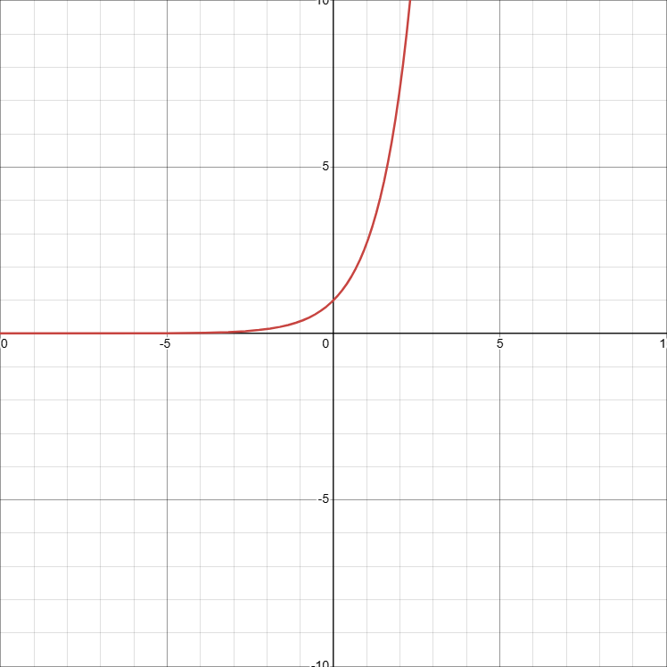
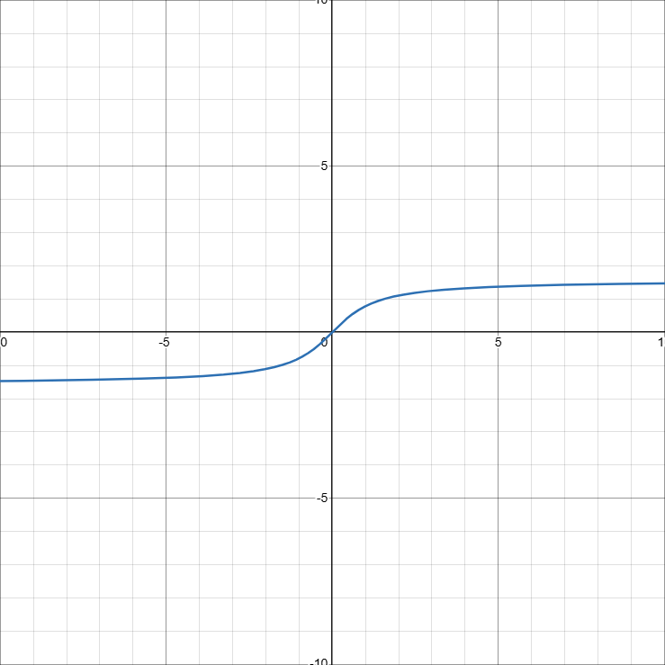

# 序

## 主要内容

[课程内容思维导图](图片/思维导图/课程内容.km)

---

# 函数 极限 连续

## 一、函数（对象）

### （一）函数的概念及常见函数

#### 1️⃣ 函数（定义）
   - **定义域**
   - 值域
   - **对应规则**
#### 2️⃣ 复合函数

#### 3️⃣ 反函数

> $y=(x)$ 的反函数 $x=f^{-1}(y)$ 等价于 $y=f^{-1}(x)$
- **充要条件：** $$\forall x_1\neq x_2 \in D, \rightarrow f(x_1)\neq f(x_2)\qquad\tag{函数为一一映射}$$
- **单调**函数一定有反函数，反之不然（充分不必要）
- $y=(x)$ 和 $y=f^{-1}(x)$ 关于 $y=x$ 对称

##### ⭕反函数的求解

1. 用$x$表示$y$
2. 用$y$表示$x$
3. 交换$x$和$y$

> **例：** 求 $y=x^3$ 的反函数
> 1. $y=x^3$ - （用$x$表示$y$）
> 2. $x=\sqrt[3]{y}$ - （用$y$表示$x$）
> 3. $y=\sqrt[3]{x}$ - （交换$x$和$y$）

#### 4️⃣ 初等函数

### （二）❗函数的性质

#### 2️⃣ 奇偶性

> **例：** 证明 $f(x)=ln(x+\sqrt{1+x^2})$ 是奇函数
> 显然 $f(x)=ln(x+\sqrt{1+x^2})$ 的定义域关于原点对称。由于
> $$ f(-x)=ln(-x+\sqrt{1+x^2})=ln\cfrac{1}{x+\sqrt{1+x^2}} \qquad(有理化)$$
> $$ =-ln(x+\sqrt{1+x^2})=-f(x), $$
> 故 $f(x)=ln(x+\sqrt{1+x^2})$是奇函数
>
> 此处利用了有理化，同乘 $x+\sqrt{1+x^2}$ 后利用平方差公式消去$-x+\sqrt{1+x^2}$

#### 3️⃣ 周期性

1. $\sin\;x$，$\cos\;x$ 周期$2\pi$；$\sin\;2x$，$\vert \sin\;x \vert$ 周期 $\pi$；
2. 若 $f(x)$ 以$T$为周期，则$f(ax+b)$以$\cfrac{T}{\vert a \vert}$为周期

#### 4️⃣ 有界性

##### 🔴 常见有界函数

- $\vert \arcsin\; x\vert \leq \cfrac{\pi}{2}$（定义域为$x\in (-1,1)$）
- $\arctan\; x < \cfrac{\pi}{2}$

---
## 二、极限（工具）

### （一）极限的概念

#### 1️⃣ 数列的极限（$\epsilon-N$定义）
- 常见反例：$x_n=(-1)^n$
- $\underset{n \rightarrow \infty}{lim}x_n=0$ 的充分必要条件是 $\underset{n \rightarrow \infty}{lim}\vert x_n \vert = 0 $

#### 2️⃣函数的极限（$\epsilon-\delta$定义）
- $x\rightarrow0, x\neq0$

##### 🚩分左右极限求解的情况
1. **分段函数**
2. **$e^\infty$型**

3. **$\arctan \;\infty$型**

### （二）极限的性质
1. 有界性
2. ❗保号性（极限保函数值/函数值保极限）
> 确定的值 >0 / <0
3. 极限值与无限小之间的关系

### （三）极限存在准则
1. 夹逼定理（n项和）
2. 单调有界准则（$x_{n+1}=f(x_n)$）

### （四）无穷小量
1. 概念
2. 比较（**等价无穷小**）
$$
\sin x < x <\tan x
$$
3. 性质（等号成立条件）

### （五）无穷大量
1. 概念
2. **比较**
$$ln^\alpha x\ll x^{\beta}\ll a^x\qquad（x\rightarrow +\infty）$$ $$ln^\alpha n\ll n^{\beta}\ll a^n\ll n!\ll n^n\qquad（n\rightarrow +\infty）$$
3. 性质
> **和** $-\infty,\; +\infty$
> **有界函数之积** $*0$
4. 无穷大量和无界变量
5. 无穷大量与无穷小量的关系

---

## 三、连续（形态）

### （一）概念

### （二）间断点及其分类

**第一类** 左右极限存在
  - 可去间断点 左右极限存在且相等
  - 跳跃间断点

**第二类** 左右极限至少有一个不存在
  - 无穷间断点
  - 振荡间断点

### （三）连续性的运算及性质
- 最值定理
- 介值定理
- 零点定理

### （四）闭区间上连续函数的性质

---

## 📌题型解析

### （一）❗函数的性质

- 函数有界性、单调性、周期性及奇偶性的判定

### （二）复合函数

### （三）极限的概念性质及存在准则（难）

### （四）求极限（重）

#### ❕ 常用基本极限
$$\underset{x\rightarrow 0}{\lim}\;\cfrac{\sin\;x}{x}=1$$

$$\begin{cases}
\underset{x\rightarrow 0}{\lim}\;(1\pm x)^{\pm\frac{1}{x}}=e\\
\underset{x\rightarrow\infty}{\lim}\;(1\pm\frac{1}{x})^{\pm x}=e\tag{同号为正，异号为倒}
\end{cases}$$

$$\underset{x\rightarrow 0}{\lim}\;\cfrac{a^x-1}{x}=\ln\;a$$

$$\begin{cases}
\underset{x\rightarrow\infty}{\lim}\;\sqrt[n]{n}=1\\
\underset{x\rightarrow\infty}{\lim}\;\sqrt[n]{a}=1 \quad (a>0)
\end{cases}$$

#### ❌“$1^\infty$”型极限
> $\alpha(x)\rightarrow0 \qquad \beta(x)\rightarrow \infty$
1. **原式** $= \lim\; [1+\alpha(x)]^{\beta(x)}$
2. **求极限** $\lim\; \alpha(x)\beta(x)=A$
3. **写结果** $=e^A$

#### ⭕“$1^0$”型极限
> $\alpha(x)\rightarrow0 \qquad \beta(x)\rightarrow 0$

- $\lim\; [1+\alpha(x)]^{\beta(x)} \;\sim\; \alpha(x)\beta(x)$

#### ⛔“$\frac{\infty}{\infty}$或“$\frac{0}{0}$”型极限
> 1. $\lim\; f(x) = lim\; g(x) = 0或\infty$
> 2. $\lim\; \cfrac{f'(x)}{g'(x)} \; 存在或为 \;\infty$ <mark>**由后推前**</mark>
> 3. 适用范围： $0\cdot\infty$、$\infty^0(改为e)$

- $\lim\; \cfrac{f(x)}{g(x)}\; =\lim\; \cfrac{f'(x)}{g'(x)}$

#### $n$项和极限
> 夹逼定理
> 定积分的定义

#### ✅等价无穷小

$1、常见$
$$\qquad x \;\sim\; \sin\;x \;\sim\; \tan\;x \;\sim\; \arcsin\;x \;\sim\; \ln(1+x) \;\sim\; e^x-1 $$

$2、含\ln或幂$
$$\begin{cases}
(1+x)^a-1 \;\sim\; ax \quad (a\neq0)\\
\qquad a^x-1 \;\sim\; x\ln a\\
x-\ln(1+x) \;\sim\; \frac{1}{2}x^2
\end{cases}$$

$3、三角函数$ <mark>**推导：**</mark> 泰勒展开+几何级数
$$\begin{cases}
1-\cos x \;\sim\; \frac{1}{2}x^2\\
x-\sin x \;\sim\; \frac{1}{6}x^3\\
\tan x-x \;\sim\; \frac{1}{3}x^3
\end{cases}$$

$4、反三角函数$
$$\begin{cases}
\arcsin x-x \;\sim\; \frac{1}{6}x^3\\
x-\arctan x \;\sim\; \frac{1}{3}x^3
\end{cases}$$   

#### 洛必达法则
函数$n$阶可导$→$可用$n-1$次洛必达，$n$阶导数定义

#### 💔泰勒展开（带皮亚诺余项）
> 奇函数（$\sin x$、$\tan x$）的泰勒展开只有奇次项（$x$、$x^3$），偶函数（$\cos x$）的泰勒展开只有偶次项（$x^0$、$x^2$）

$$f(x)=f(x_0)+\frac{f'(x_0)}{1!}(x-x_0)+…+\cfrac{f^{(n)}}{n!}(x-x_0)^n+o[(x-x_0)^n]$$

$$=\sum\limits_{i=0}^{n}\frac{f^{(i)}(x_0)}{i!}(x-x_0)^i+o(x^n)$$

**常用泰勒展开**

$$e^x=1+x+\cfrac{x^2}{2!}+…+\frac{x^n}{n!}+o(x^n)$$

$$\sin x=x-\cfrac{x^3}{3!}+…+(-1)^{n-1}\frac{x^{2n-1}}{(2n-1)!}+o(x^{2n-1})$$

$$\cos x=1-\cfrac{x^2}{2!}+…+(-1)^n\frac{x^{2n}}{(2n)!}+o(x^{2n})$$

$$\tan x=x+\frac{1}{3}x^3+\frac{2}{15}x^5+\frac{17}{315}x^7+…$$

$$\ln(x+1)=x-\frac{x^2}{2!}+…+(-1)^{n-1}\frac{x^n}{n}+o(x^n)$$

$$(1+x)^a=1+ax+\cfrac{a(a-1)}{2!}x^2+…+\frac{a(a-1)…(a-n+1)}{n!}x^n+o(x^n)$$

**更加常用**

$$e^x=1+x+\frac{x^2}{4}+o(x^2)$$

$$\sin x=x-\frac{x^3}{6}+o(x^3)$$

$$\cos x=1-\frac{x^2}{2}+o(x^2)$$

$$\tan x=x+\frac{x^3}{3}+o(x^3)$$

$$\ln(x+1)=x-\cfrac{x^2}{2}+o(x^2)$$

$$(1+x)^2=1+2x+x^2+o(x^2)$$

#### 拉格朗日中值定理

### （五）无穷小量阶的比较（重）

### （六）函数连续性及间断点的类型（重）

### （七）闭区间上连续函数性质的证明

# 导数与微分

## 一、导数

### （一）导数与微分的概念

$$
f'(x_0)=\underset{x\rightarrow x_0}{lim}\cfrac{f(x)-f(x_0)}{x-x_0}
\qquad 
f'(x_0)=\underset{\Delta x\rightarrow 0}{lim}\cfrac{f(x_0+\Delta x)-f(x_0)}{\Delta x}
\tag{导数定义}
$$

$$
dy=f'(x_0)\Delta x=f'(x_0)dx
$$

设$f(x)=\varphi(x)|x-a|$，其$\varphi(x)$在$x=a$处连续，则$f(x)$在$x=a$处可导的充要条件是$\varphi(a)=0$

## 二、导数公式和运算法则

### 1. 基本初等函数
1. $(a^x)'=a^x\ln x$
2. $(\log_a x)'=\cfrac{1}{x\ln a}$
3. $(\ln |x|)'=\cfrac{1}{x}$
4. $(\tan x)'=\sec^2 x$
5. $(\cot x)'=-\csc^2 x$
6. $(\sec x)'=\sec x \tan x$
7. $(\csc x)'=-\csc x \cot x$
8. $(\arcsin x)'=\cfrac{1}{\sqrt{1-x^2}}$
9. $(\arccos x)'=-\cfrac{1}{\sqrt{1-x^2}}$
10. $(\arctan x)'=\cfrac{1}{1+x^2}$
11. $(arc\cot x)'=-\cfrac{1}{1+x^2}$

### 2.隐函数
> 直接求导，将$y'$单独提出

### 3.反函数
$y=f(x)$与$x=\varphi(y)$均可导且$f'(x)\neq0$时，$\varphi'(y)=\cfrac{1}{f'(x)}$
> 反函数的导数是原函数导数的倒数

### 4.参数方程
设$y=(x)$是由
$$
\begin{cases}
  x = \varphi(t)\\
  y = \psi(t)
\end{cases}
$$
确定的函数，其中$\alpha<t<\beta$

1）若$\varphi(t)$和$\psi(t)$都可导，且$\varphi(t)\neq0$，$\cfrac{dy}{dx}=\cfrac{\psi'(t)}{\varphi'(t)}$

2）若$\varphi(t)$和$\psi(t)$二阶可导，且且$\varphi(t)\neq0$，则
$$
\cfrac{d^2y}{dx^2}
= \cfrac{d}{dt}(\cfrac{\psi'(t)}{\varphi'(t)})\cfrac{1}{\varphi'(t)}
= \cfrac{\psi''(t)\varphi'(t) - \varphi''(t)\psi'(t)}{\varphi'''{t}}
$$
> 

### 4. 对数
> 连乘、连除、乘方、开方

## 三、高阶导数
1. $(\sin x)^{(n)}=\sin (x+n \cdot \frac{\pi}{2})$
2. $(\cos x)^{(n)}=\cos (x+n \cdot \frac{\pi}{2})$
3. $(u \pm v)^{(n)}=u^{(n)} \pm v^{(n)}$
4. $(uv)^{(n)}=\sum\limits_{k=0}^{n} \mathrm{C}_{n}^{k} u^{(k)} v^{(n-k)}$

## 📌题型解析

### （一）导数与微分
1. 利用导数定义求极限
2. 利用导数定义求导数
3. 💔利用导数定义判断可导性

### （二）⭕复合函数、隐函数、参数方程求导

### （三）💔高阶导数
1. 公式
2. 求$y',y''$归纳
3. 泰勒展开

### （四）导数应用
1. 切线、法线
2. 相关变化率

# 微分中值定理及导数应用

## 一、微分中值定理
- 费马引理
- **罗尔定理**
> 1. 在$[a,b]$上连续
> 2. 在$(a,b)$上可导
> 3. $f(a)=f(b)$
> 则在$(a,b)$中至少存在一点$\xi$，使得$f'(\xi=0)$
- 拉格朗日中值定理
- 柯西中值定理
- 皮亚诺余项型泰勒公式
- 拉格朗日余项型泰勒公式

## 二、导数应用
- 函数的单调性
- 函数的极值
- 函数的最大值和最小值
- 曲线的凹凸性
- 曲线的渐进性
- 作图
- 曲线的弧微分与曲率
- 

## 📌题型解析

### （一）求极限

### （二）函数的极值和最值，曲线的凹向和拐点
**拐点**：凹凸性发生变化的点，$f''(x)=0$

### （三）⭕曲线的渐近线
> 渐近线的定义推广：若$f(x)=ax+b+\alpha(x)$
> 其中$\underset{x\rightarrow \infty}{lim}\alpha(x)=0$，则直线$y=ax+b$为曲线$y=f(x)$的斜渐近线。

### （四）⭕方程的根
**存在性**
- 零点存在性定理
   1. 连续
   2. $f(a)\cdot f(b)<0$
- 罗尔定理

**个数**
- 函数单调性

### （五）不等式的证明
- **单调性**
  1. 令两函数之差为$f(x)$
  2. 证明$f'(x) > 0, f(x)$单调递增
- **拉格朗日中值定理**

- **最大最小值**
> $a$最大值小于$b$的最小值，则$a<b$

### （六）💔中值定理的证明题

# 不定积分

## 一、不定积分的概念和性质

1. **原函数**

2. **不定积分**

3. **不定积分的几何意义**

4. **原函数存在定理**
> ①是否连续(一定有)
> ②若不连续，存在第一类间断点（有则一定不存在）还是第二类间断点（有则有可能存在）
> ③有无明显的原函数

5. **不定积分的性质**

## 二、不定积分基本公式 p107

$$
\begin{aligned} &
(1)\int 0 \ dx = C \\ &
(2)\int x^a \ dx = \dfrac{1}{a+1}x^{a+1} + C \quad (a \neq -1) \\ &
(3)\int \dfrac{1}{x} \ dx = \ln |x| + C \\ &
(4)\int a^x \ dx = \cfrac{a^x}{\ln a} + C \quad (a > 0,a \neq 1) \\ &
(5)\int e^x dx = e^x + C \\ &
(6)\int \sin x dx = -\cos x + C \\ &
(7)\int \cos x dx = \sin x + C \\ &
(8)\int \sec^2 x dx = \tan x + C \\ &
(9)\int \csc^2 x dx = -\cot x + C \\ &
(10)\int \sec x \tan x \ dx = \sec x + C \\ &
(11)\int \csc x \cot x \ dx = -\csc x + C \\ &
(12)\int \dfrac{1}{\sqrt{1-x^2}} \	 dx = \arcsin x + C \\ &
(13)\int \dfrac{1}{1+x^2} \	 dx = \arctan x + C \\ &
(14)\int \dfrac{dx}{\sqrt{a^2 - x^2}} = \arcsin \dfrac{x}{a} + C \\ &
(15)\int \dfrac{dx}{a^2 + x^2} = \dfrac{1}{a}\arctan \dfrac{x}{a} + C \\ &
(16)\int \dfrac{dx}{x^2 - a^2} = \dfrac{1}{2a}\ln|\cfrac{x-a}{x+a}| + C \\ &
(17)\int \frac{dx}{\sqrt{x^{2}+a^{2}}}=\ln(x+\sqrt{x^{2}+a^{2}}) + C \\ &
(18)\int \frac{dx}{\sqrt{x^{2}-a^{2}}}=\ln | x+\sqrt{x^{2}-a^{2}} | + C \\ &
(19)\int \sec x \ dx = \ln | \sec x+\tan x | + C \\ &
(20)\int \csc x \ dx = - \ln | \csc x+\cot x| + C
\end{aligned}
$$

## 三、⭕三种主要积分法

### （一）第一换元积分法
$$
\begin{aligned} & 
(1)\int f(ax+b)dx = \frac{1}{a} \int f(ax+b) \ dx(ax+b) \\ & 
(2)\int x^mf(ax^{m+1}+b)dx = \frac{1}{(m+1)a}\int f(ax^{m+1}+b) \ dx(ax^{m+1}+b)\quad(m\neq-1) \\ & 
(3)\int f(\sqrt{x})\frac{dx}{\sqrt{x}} = 2\int f(\sqrt{x})dx(\sqrt{x}) \\ & 
(4)\int f(e^x)e^xdx = \int f(e^x)dx(e^x) \\ & 
(5)\int f(\ln x)\frac{1}{x}dx = \int f(\ln x)dx(\ln x) \\ & 
(6)\int f(\sin x)\cos xdx = \int f(\sin x)dx(\sin x) \\ & 
(7)\int f(\cos x)\sin xdx = -\int f(\cos x)dx(\cos x) \\ & 
(8)\int f(\tan x)\frac{1}{\cos^{2}x}dx = \int f(\tan x)dx(\tan x) \\ & 
(9)\int f(\arcsin x)\frac{1}{\sqrt{1-x^{2}}}dx = \int f(\arcsin x)dx(\arcsin x) \\ & 
(10)\int f(\arctan x)\frac{1}{1+x^{2}}dx = \int f(\arctan x)dx(\arctan x)
\end{aligned}
$$

### （二）第二换元积分法

- $\sqrt{a^2-x^2}$，令$x=a \sin t$或$x=a \cos t$
- $\sqrt{a^2+x^2}$，令$x=a \tan t$
- $\sqrt{x^2-a^2}$，令$x=a \sec t$

### （三）分部积分法（加减交替，+-+……）
$$\int uv' \ dx = uv - \int u'v \ dx$$

$$\underset{dx\leftarrow}{反} 对 \; 幂 \; 指\underset{\rightarrow \int}{三}$$

#### ⭕表格积分法
1. **含多项式积分**
> 对**多项式**求导至$0$，对$e^{ax},\sin bx$积分

2. **$\sin x，e^{ax}$积分**
> 对$\sin x$求导，对$e^{ax}$积分直到**循环**（指出现一开始求导时的$\int$项）

3. 万能公式 
$$\int e^{ax}\sin bx \ dx = \cfrac{1}{a^{2}+b^{2}} \ e^{ax}(a\sin bx - b\cos bx) + C$$ $$\int e^{ax}\cos bx \ dx = \cfrac{1}{a^{2}+b^{2}} \ e^{ax}(b\sin bx + a\cos bx) + C$$

## 四、三类常见可积函数的积分

- **常见无法被积函数**
$$
\int e^{-x^{2}}dx \qquad 
\int\cfrac{\sin x}{x}dx \qquad 
\int\cfrac{\cos x}{x}dx
$$

### （一）有理函数积分

#### 1️⃣加减项
1. 对分母进行求导确定分子（或者说$d$什么什么）
2. 对剩余项分母凑$\int \cfrac{1}{{(x\pm a)}^2+ b^2} \ d(x\pm a) = \cfrac{1}{a} \arctan \cfrac{x}{a} + C$

#### 2️⃣部分分式法

1. **拆项**
> 拆分为简单真分式$\cfrac{1}{x-a}$或$\cfrac{Ax+B}{ax^2+bx+c}$
> $\cfrac{1}{(x^a-1)^b}$，其中$a$为次数，$b$为重数，重数为$n$意味着要重复$+n$次
2. **求待定系数**
> A **留数**
> B **极限**
> C **特殊值**
> D **求导**
> ~~F 同时乘分母构造方程组求解~~
3. **积分**

### （二）三角有理函数积分

#### 1️⃣万能代换
> 令$\tan \cfrac{x}{2} = t$
> $\int R(\sin x,\cos x)dx = \int R(\cfrac{2t}{1+t^2},\cfrac{1-t^2}{1+t^2})\cfrac{2}{1+t^2}dt$

#### 2️⃣三角换元
①若$R(-\sin x,\cos x)=-R(\sin x,\cos x)$，令$u = \cos x$
②若$R(\sin x,-\cos x)=-R(\sin x,\cos x)$，令$u = \sin x$
③若$R(-\sin x,-\cos x)=R(\sin x,\cos x)$，令$u = \tan x$

### （三）简单无理函数积分
> 形如$\int R (x, \sqrt[a]{ \cfrac{ax + b}{cx + d}})dx$的积分，
> 令$\sqrt[a]{ \cfrac{ax + b}{cx + d}} = t$ 或 **进行有理化**

## 📌题型解析：求不定积分（换元、分部）

### （一）换元

### （二）分部
**两类不同函数相乘/除**（反对幂指三）

# 定积分和反常积分

## 一、定积分

### （一）定积分的定义

#### 1️⃣定积分的定义

#### 2️⃣定积分存在的充分条件（有界）

#### 3️⃣定积分的几何意义
> 图像与$x$轴围成的面积
> 交换上下限时，面积相反

### （二）定积分的性质

#### 1️⃣不等式性质（放缩）

#### 2️⃣中值定理（证明）

### （三）积分上限的函数

- 设函数$f(x)$在$[-l,l]$上连续，若$f(x)$为奇/偶函数，那么$\int_0^xf(t)dt$为偶/奇函数

### （四）定积分的计算

#### 1️⃣牛顿-莱布尼兹公式

#### 2️⃣换元积分法

上下限随着变量的改变

#### 3️⃣分部积分法

#### ⚠利用奇偶性和周期性

1. 设$f(x)$为$[-a,a]$上的连续函数$(a>0)$,则
$$
\int^{a}_{-a}f(x)dx=
\begin{cases}
  0，\qquad f(x)为奇函数 \\
  2\int^a_0f(x)dx, \qquad f(x)为偶函数
\end{cases}
$$

2. 设f(x)是以T为周期的连续函数，则对任给数a，总有
$$
\int_a^{a+T}f(x) dx = \int_0^T f(x) dx
$$

#### 📌利用已有公式

$$
(1) \int^{\frac{\pi}{2}}_0 \sin^n x = \int^{\frac{\pi}{2}}_0 \cos^n x = 
\begin{cases}
  \cfrac{n-1}{n} * \cfrac{n-3}{n-2} * \cdots * \cfrac{1}{2} * \cfrac{\pi}{2}，\qquad n为正偶数 \\
  \\
  \cfrac{n-1}{n} * \cfrac{n-3}{n-2} * \cdots * \cfrac{2}{3}，\qquad n为大于1的奇数
\end{cases}
$$

$$
(2) \int^{\pi}_0 xf(\sin x)dx = \cfrac{\pi}{2}\int^{\pi}_0f(\sin x)dx \qquad(其中f(x)连续)
$$

## 二、反常积分

### （一）无穷区间上的反常积分

#### 1️⃣比较判别法
> 小的发散，大的发散
> 大的收敛，小的收敛

设$f(x),g(x)$在$[a,+\infty)$上连续，且$0\leq f(x)\leq g(x)$，则
$（1）$当$\int^{+\infty}_a g(x)$收敛时，$\int^{+\infty}_a f(x)$收敛
$（2）$当$\int^{+\infty}_a f(x)$发散时，$\int^{+\infty}_a g(x)$发散

#### 2️⃣比较判别法的极限形式

设$f(x),g(x)$在$[a,+\infty)$上非负连续，且$\underset{x\rightarrow+\infty}{lim}\cfrac{f(x)}{g(x)}=\lambda$，则
$（1）$当$\lambda\neq0$时，$\int^{+\infty}_a g(x)$与$\int^{+\infty}_a f(x)$同敛散
$（2）$当$\lambda=0$时，若$\int^{+\infty}_a g(x)$收敛，则$\int^{+\infty}_a f(x)$也收敛
$（2）$当$\lambda=+\infty$时，若$\int^{+\infty}_a g(x)$发散，则$\int^{+\infty}_a f(x)$也发散

#### 3️⃣$p$函数
$$
\int^{+\infty}_a \cfrac{1}{x^p}dx
\begin{cases}
p > 1，收敛\\
p \leq 1，发散
\end{cases}
\tag{a > 0}
$$
测试一下为什么
#### 4️⃣定义

### （二）无界函数的反常积分
- 瑕点

#### 1️⃣比较判别法
设$f(x),g(x)$在$[a,+\infty)$上连续，且$0\leq f(x)\leq g(x)$，$x=a$为$f(x)$和$g(x)$的瑕点，则
$（1）$当$\int^{+\infty}_a g(x)$收敛时，$\int^{+\infty}_a f(x)$收敛
$（2）$当$\int^{+\infty}_a f(x)$发散时，$\int^{+\infty}_a g(x)$发散

#### 2️⃣比较判别法的极限形式
设$f(x),g(x)$在$[a,+\infty)$上非负连续，且$\underset{x\rightarrow+\infty}{lim}\cfrac{f(x)}{g(x)}=\lambda$，则
$（1）$当$\lambda\neq0$时，$\int^{+\infty}_a g(x)$与$\int^{+\infty}_a f(x)$同敛散
$（2）$当$\lambda=0$时，若$\int^{+\infty}_a g(x)$收敛，则$\int^{+\infty}_a f(x)$也收敛
$（2）$当$\lambda=+\infty$时，若$\int^{+\infty}_a g(x)$发散，则$\int^{+\infty}_a f(x)$也发散

#### 3️⃣$p$函数
$$
\int^{+\infty}_a \cfrac{1}{(x-a)^p}dx
\begin{cases}
p \leq 1，收敛\\
p > 1，发散
\end{cases}
\tag{a > 0}
$$

$$
\int^{+\infty}_a \cfrac{1}{(b-x)^p}dx
\begin{cases}
p \leq 1，收敛\\
p > 1，发散
\end{cases}
\tag{a > 0}
$$

## 📌题型解析

### （一）定积分的概念、性质及几何意义

### （二）‼定积分计算

### （三）🔴变上限积分

#### 1️⃣直接
$(\int_{\varphi_1(x)}^{\varphi_2(x)}f(t)dt)^{\prime}=f[\varphi_2(x)]\bullet\varphi_2^{\prime}(x)-f[\varphi_1(x)]\bullet\varphi_1^{\prime}(x)$

#### 2️⃣拆项

#### 3️⃣换元

#### 4️⃣估阶
$\int^{\varphi(x)}_0f(t)dt的阶数：\varphi(x)的阶数*（f(t)的阶数+1）$

#### 5️⃣积分中值定理
若$f(x),g(x)$在$[a,b]$上连续，$g(x)$不变号，则$\int_a^bf(x)g(x)dx=f(\xi)\int_a^bg(x)dx(a\leqslant\xi\leqslant b)$

### （四）反常积分的敛散性

### （五）反常积分的计算

1️⃣定义
2️⃣分部
3️⃣换元

# 定积分应用

## 一、几何应用

### （一）平面图形的面积
$$
\begin{align}
直角坐标\; &S=\int_a^b[f(x)-g(x)]dx \\
极坐标\quad &S=\cfrac{1}{2}\int_\alpha^\beta\rho^2(\theta)d\theta \\
二重积分\; &S=\underset{D\;\;}{\iint}1 \; d\delta
\end{align}
$$
> 极坐标下$d\theta=\rho d\rho \theta$

### （二）旋转体体积
$$
\begin{align}
绕x轴旋转\quad & V_x=\pi\int_b^af^2(x)dx \\
绕x轴旋转\quad & V_y=\pi\int_b^axf(x)dx \\
绕任意直线\quad & V=2\pi \underset{D\;\;}{\iint}r(x,y)d\delta
\end{align}
$$
> 任一点绕某直线旋转的体积微元$dV=2\pi r(x,y)d\delta$
> 点到直线的距离$r(x,y)=\cfrac{|ax+by+c|}{\sqrt{a^2+b^2}}$
> - $x$轴：$r(x,y)=y$
> - $y$轴：$r(x,y)=x$

### （三）曲线弧长
$$
\begin{align}
C:y=y(x) \quad & a\leq x\leq b.\quad s=\int_a^b\sqrt{1+y^{\prime2}}dx \\
C:
  \begin{cases}
  x=x(t) \\
  y=y(t)
  \end{cases}
\quad & \alpha\leq t\leq\beta.\quad s=\int_\alpha^\beta\sqrt{x^{\prime2}+y^{\prime2}}dt \\
C:\rho=\rho(\theta) \quad & \alpha\leq\theta\leq\beta.\quad s=\int_\alpha^\beta\sqrt{\rho^2+\rho^{\prime2}}d\theta
\end{align}
$$

### （四）旋转体侧面积
$$S=2\pi\int_a^bf(x)\sqrt{1+f^{\prime2}(x)}dx$$

## 二、物理应用
1. 压力
2. 变力做功
3. 引力
- **微元法**
- **元素法**

# 常用公式

## 不等式
- **取整函数不等式** $\quad x-1<[x]\leq x<[x]+1$
- **绝对值不等式** $\;\;\quad \vert\vert a\vert-\vert b\vert\vert\leq\vert a\pm b\vert\leq\vert a\vert+\vert b\vert$
- **基本不等式** $\;\;\qquad 2ab\leq a^2+b^2$

## 排列组合

- **排列数** $A^m_n=\cfrac{n!}{(n-m)!}$
- **组合数** $C^m_n=\cfrac{n!}{(n-m)!m!}$

# 三角函数

## 一、三角恒等变换

### （一）倍角公式
$\sin2a = 2\sin a \cos a$
$\cos2a = \cos^2a - \sin^2a = 2\cos^2 - 1$

### （二）半角公式
$\sin \cfrac{x}{2} = \pm \sqrt{\cfrac{1 - \cos x}{2}} $
$\cos \cfrac{x}{2} = \pm \sqrt{\cfrac{1 + \cos x}{2}} $
$\sin \cfrac{x}{2} = \pm \sqrt{\cfrac{1 - \cos x}{1 + \cos x}} $

### （三）三角关系

$\sec x = \cfrac{1}{\cos x} \qquad $
$\csc x = \cfrac{1}{\sin x} \; ,\; \int \csc^2 x = -\cot x$
$\cot x = \cfrac{1}{\tan x}=\cfrac{\cos x}{\sin x} \qquad $

$1 + \tan^2 x = \sec^2 x$

## 反三角函数
> 注意取值范围
$\sin\theta=a$ 且 $\theta\in[-\cfrac{\pi}{2},\cfrac{\pi}{2}]$ 时$\theta=\arcsin a$

# 有理根定理
设多项式$f(x) = a_n x^n + a_{n-1} x^{n-1} + \cdots + a_1 x + a_0$，其中所有系数$a_i \in \mathbb{Z}$ 且 $ a_n \neq 0 $。若 $ \frac{p}{q} $ 是该多项式的有理根（最简形式，即 $ \gcd(p, q) = 1 $），则：

$ p \mid a_0 $（$ p $ 整除常数项）
$ q \mid a_n $（$ q $ 整除首项系数）

设 $\cfrac{p}{q} $ 是多项式的根，即：$$ f(\cfrac{p}{q}) = 0 $$

即：$$a_n (\cfrac{p}{q})^n + a_{n-1} (\cfrac{p}{q})^{n-1} + \cdots + a_1 (\cfrac{p}{q}) + a_0 = 0$$
两边同时乘以 $ q^n $ 得：
$$ a_n p^n + a_{n-1} p^{n-1} q + \cdots + a_1 p q^{n-1} + a_0 q^n = 0 $$
即
$$ a_n p^n + a_{n-1} p^{n-1} q + \cdots + a_1 p q^{n-1} = -a_0 q^n $$

提取公因子 $ p $，即：$$ p \mid a_0 q^n $$

由于 $ \gcd(p, q) = 1 $，所以 $ p $ 与 $ q^n $ 互质，因此
$$ p \mid a_0 $$

同理
$$ q \mid a_n $$

## 例
考虑多项式：$$f(x)=2x^3−3x^2−11x+6$$
- 常数项$a_0=6$，因数为：$\pm1,\pm2,\pm3,\pm6$
- 首项系数$a_n=2$，因数为：$\pm1,\pm2$
所以可能的有理根为：$$\pm1,\pm2,\pm3,\pm6,\pm\cfrac{1}{2},\pm\cfrac{3}{2}$$