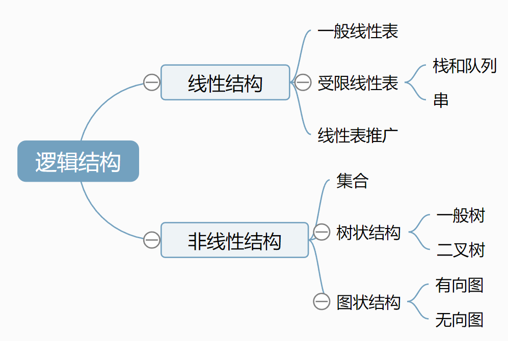

# 绪论

## 一、基本概念

1. 数据（值&关系）
2. 数据元素
3. 数据对象
4. 数据类型和**抽象数据类型**
> 定义了抽象数据类型就确定了一种数据结构
5. 数据结构

## 二、数据结构三要素
> **逻辑结构** 抽象表达
> **存储结构** 具体实现 影响空间分配和数据运算速度

### （一）逻辑结构
[课程内容思维导图](图片/思维导图/数据结构三要素.km)


### （二）存储结构
> 包括数据元素的**值**和**关系**
1. **顺序存储**（顺序表、树、图）
2. **链式存储**（链表）
3. **索引存储**（）
4. **散列（哈希）存储**（哈希表）

### （三）数据的运算

## 三、算法基本概念

### （一）重要特性
1. **有穷性**（程序无穷）
2. **确定性**
3. **可行性**
4. 输入（0个或n个）
5. 输出（1个或n个）

### （二）目标
1. 正确性
2. 可读性
3. 健壮性
4. 高效率与低存储要求

## 四、算法的效率
> 注意执行次数与规模，与变量无必然关系

### 时间复杂度
> 常对幂指阶

$O(n^3)<O(2^n)<O(n!)<O(n^n)$
1. 最好
2. 平均
3. 最差

#### 1）单层循环
1. 观察终止条件，变量（$<$、$\leq$视为$=$）
2. 找到循环次数和终止条件的关系

#### 2）双层循环

**\*1️⃣循环次数法**
> 存在乘法*

1. 外层循环次数
2. 内层循环次数
3. 外层循环次数*内层循环次数

**\*2️⃣列表法**
> 能方便写出循环次数与运行次数

**例：**
```
int m=0, i, j;
for(i=1; i<=n;i++)
    for(j=1; j<=2*i; j++)
        m++
```
> $i \;=\; 1 \quad 2 \quad 3 \quad 4 \;\dots\;\; n$
> $j \;=\; 2 \quad 4 \quad 6 \quad 8 \;\dots\; 2n$
> 当执行次数$i=n$次时，内层循环次数总共为$\cfrac{(2+2n)n}{2}=n(n+1)$
**\*与循环次数（问题规模n）进行区分**

#### 3）递归
> **Master公式**
> $d<log_ba$ 时，$O(n^{log_ba})$
> $d=log_ba$ 时，$O(n^d*log_bn)$
> $d>log_ba$ 时，$O(n^d)$

> $a$ 调用几次递归
> $b$ 递归一次规模缩小多少
> $d$ 递归以外的代码的时间复杂度（$for$循环等）

### 空间复杂度
1. 数组
2. 函数递归

# 线性表

- 定义：相同数据类型的有限**序列**
- 基本操作：创销、增删改查

> 线性表**位序**从1开始，但是存放的数组下表从0开始

## 顺序表示/存储 顺序表


- 静态**数组**分配（确定最大长度）
- 动态**指针**分配（可变最大长度）

> 逻辑相邻则物理相邻
> 随机访问，存储密度高，扩容困难，插入删除繁琐

基本操作
- 插入
- 删除

### 特点
- **随机访问（存取）**
- 存储密度高
- 扩展容量不方便
- 插入删除数据元素不方便（交换方便）

## 链式表示/存储 链表

> 不可随机存取

> 不带头结点时判空条件为`head == NULL`

- 表头指针：指向第一个节点
- 头结点：一个非数据节点，位于首位（方便运算实施）
- 首元节点：第一个数据节点

### 单链表（节省空间但是只能单向，即使有尾指针也找不到前面）

插入
- `c->next=a-next` //原a的后继连上c的后继
- `a-next=c` //c连上a的后继
 
> 判空条件：`head->next == NULL`

### 双链表（）

插入（链条不能断）
- `c->prior=a` //a连上c的前驱
- `c->next=a->next` //原a的后继变成c的后继
- `a->next->prior=c` //c连上原来a的后继的前驱
- `a->next=c`//c连上原来a的后继

删除（链条可以断）
- `a->next` //a的后继变成a前驱的后继
- `` //a的前驱连上a后继的前驱节点

> 判空条件：`head->next == NULL`

### 循环链表

> 判空条件：`head->next == head`


# 栈、队列和数组

只能在一段进行插入或删除的**线性表**

- 创销增删查、判空

## 出栈顺序

卡特兰数 $\cfrac{1}{n+1}\cfrac{(2n)!}{(n!)^2}$
比$a_i$小的需要严格递减

## 顺序栈

- 共享栈：起始分别为`-1`和`n`，二者栈顶指针相邻（相差1）时满

## 栈链

> 只有头结点的单循环栈链删除操作时间复杂度为O(n)

## 队列

只能在一段插入，另一端删除的**线性表**

队头front 删除  `front=(front+1)%MaxSize`
队尾rear 插入 `rear=(rear+1)%MaxSize`
> 二者均向队尾移动，容量为MaxSize-1

- 创销增删查、判空

### 循环队列

队列长度 `(rear-front+MaxSize)%MaxSize`
判满条件 `front==(rear+1)%MaxSize`

1. 牺牲单元
2. 设置标记
3. 记录元素个数


### 双端队列

> 使用n个队列进行出入队操作时，可以将输出队列分成n个部分，每部分连续且递增

受限输出：1两端数字递增


## 栈和队列的应用

栈
- 括号匹配
- 表达式转换
  - 操作数`a`直接输出
  - 左括号`(`入栈
  - 右括号`)`弹出运算符（左括号弹出但不输出）
  - 运算符
    - 高于栈顶运算符 入栈
    - 低于或与栈顶运算符相等 弹出并输出栈顶运算符，直到栈顶优先级低于当前再入栈
  > 左括号优先级最低
- 表达式求值
- 递归（效率较低）

队列
- 层次遍历（广度优先）
- 缓冲区

## 数组和特殊矩阵

一维数组
二维数组
> 注意矩阵和数组**开始序号**

特殊矩阵
- 对称矩阵
  - 行优先i相关，列优先j相关
  - i行有n-i+1个元素
- 三对角矩阵（$|i-j|>1$时$a_{i,j}=0$）
> 除首尾为2元素外，其余行为3元素
第$i$行从$3i-1$
- 稀疏矩阵
  - 顺序存储三元组
  - 十字链表法

# 串

- 主串
- 模式串
- 模式匹配

## 朴素模式匹配算法
> 滑动1位，每次从模式串T开头进行匹配
共有n-m+1个长为m的子串

## KMP算法（滑动n位）
1. 求next数组
2. 当不匹配时，读取最后一个匹配的字符的next数组的值n
3. 跳过前n个值 

> KMP算法 知道主串中匹配成功的，所以不会重复匹配
> 优化KMP算法 不仅知道主串中匹配成功的，还知道匹配失败的不是什么，不会用同样的去匹配


### next数组（模式串）

1. 求PM部分匹配值 `子串|真前缀|真后缀|最长公共前后缀长度`
2. next数组
   - 移位补-1（如果从1开始）
   - 全体+1
3. nextval数组
   - 首位0
   - 根据next数组序号从主串中选next串
   - 对比主串和next串，不同的地方用next数组填补
   - 相同的地方以next数组的值选择nextval中的值填补

- 滑动距离`j-nextval`

# 树和二叉树

基本概念
- 层次、高度和深度
- 结点和树的度（孩子个数）
- 分支结点和叶结点
- 路径和路径长度

性质
- 结点数$n=$各结点度数之和（分支数）$m+1$（结点和结点度数）
- 度为m的数中第i层上至多有$m^{i-1}$个结点（结点数和层数）
- 高为h的m叉树至多有$(m^h-1)/(m-1)$个结点（结点和分支数量）
- n个结点的树有n-1条边（结点和边）

## 二叉树

- 非空二叉树的叶节点数$n_0=n_2+1$ 

**满二叉树**
- 高度为h时含$2^h-1$个结点
- 编号为i的结点左孩子为$2i$，右孩子为$2i+1$，父节点为$\lfloor i/2 \rfloor$

**完全二叉树**（编号与满二叉树能够完全对应）
- $n_1=0/1$
- 若有$2k/2k+1$个结点，则有k个叶子节点，k-1个$n_2$

**二叉排序树**
左<根<右

**平衡二叉树**
- 任一结点的左子树和右子树深度之差不超过1

**正则二叉树**


线索二叉树

## 存储结构

- 双亲表示法：数据元素、指向父节点指针
  > 森林根节点设为-1
- 孩子表示法：数据元素、孩子链表头指针
  > 森林根节点为空
- 孩子兄弟表示法：数据元素、第一个孩子、右兄弟指针
  > 森林根节点为空

非空指针数=节点数-1
总指针域数-总空指针数

### 转换

**树→二叉树**
1. 画出根节点
2. 找到同一层的所有孩子
3. 斜向右下画出，第一个孩子在下一层，第二个孩子在下两层
4. 连接第一个孩子作为根节点左孩子

**森林→二叉树**
1. 各树的根节点视为兄弟

**二叉树→森林**

### 遍历

树的遍历
- 先根遍历（对应二叉树先序）
- 后根遍历（对应二叉树中序）
- 层序遍历（）

森林的遍历
- 先序遍历
- 中序遍历

> C语言标识符规则：字母或者`_`开头，可跟字母、数字和下划线
> 三目运算符 `条件:真返回:假返回;`