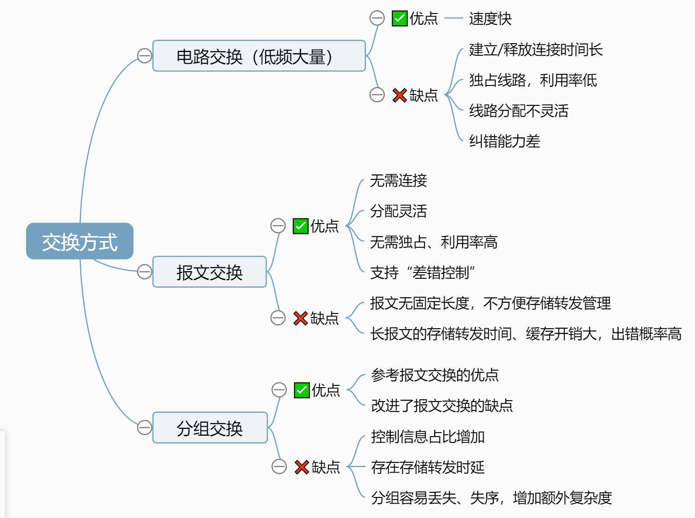
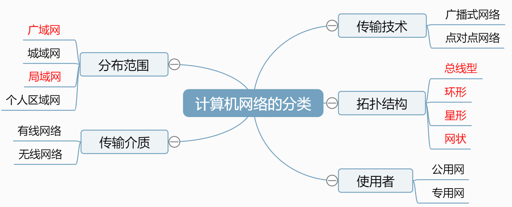
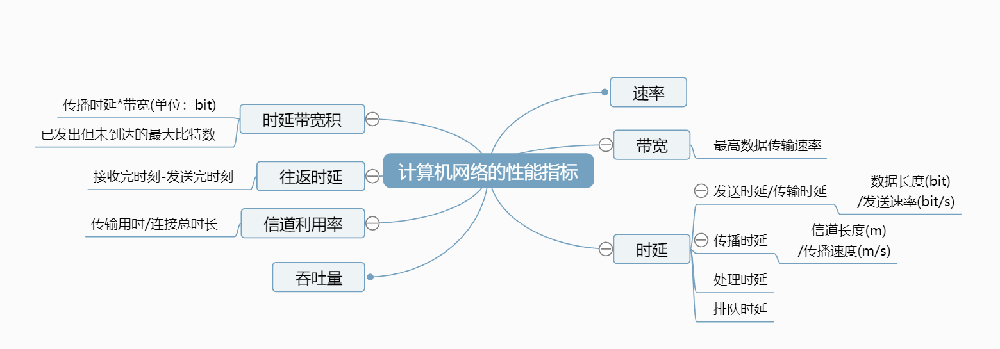

# 计算机网络体系结构

## 一、计算机网络概述

### （一）概念
1. 计算机网络
> 通过路由器连接成互联网
2. 互连网（internet）
3. 互联网、因特网（Internet）
> TCP/IP协议

### （二）组成
1. 组成部分：软件、硬件、协议
2. 工作方式：边缘部分（用户主机）、核心部分（网络及路由器）
3. 功能组成：通信子网、资源子网

### （三）功能
1. *数据通信
2. 资源共享
3. 分布式处理
4. 提高可靠性
5. 负载均衡
6. 其他

### （四）交换方式
[交换方式思维导图](图片/思维导图/交换方式.km)

### （五）分类
[计算机网络的分类思维导图](图片/思维导图/计算机网络的分类.km)

### （六）性能指标
> 区分数据量单位和速率单位

[计算机网络的性能指标思维导图](图片/思维导图/计算机网络的性能指标.km)

|数据量单位|备注|
|---|---|
|比特（b）|-|
|字节（B）|$1$B = $8$bit|
|千字节（KB）|KB = $1024$B = $2^{10}$ B|
|兆字节（MB）|MB = $1024$KB = $2^{10}$ KB|
|吉字节（GB）|GB = $1024$MB = $2^{10}$ MB|

|速率单位|备注|
|---|---|
|比特/秒（b/s）|也写作bit/s和bps|
|千比特/秒（kb/s）|kb/s = $1000$b/s = $10^3$ b/s|
|兆比特/秒（Mb/s）|Mb/s = $1000$kb/s = $10^6$ kb/s|
|吉比特/秒（Gb/s）|Gb/s = $1000$Mb/s = $10^9$ Mb/s|

## 二、计算机网络体系结构与参考模型

### （一）分层模型结构

- 实体：发送或接收信息的**硬件**和**软件进程**
> **对等实体**：通信双方**相同层次**中的实体
- 协议：两个对等实体在**水平方向**进行**逻辑通信**的**规则**的集合
- 服务：垂直使用下层服务，**向上**提供服务
> 下层协议对上层实体**透明**
> 上下层交换的命令称为**服务原语**
- 接口：服务访问点SAP

- PDU：**协议数据单元**，不同系统对等层次之间传输的数据包
- SDU：**服务数据单元**，系统内层与层之间交换的数据包
- PCI：

### （二）协议、接口、服务
1️⃣ **协议**
- 语法（信息格式）
- 语义（操作）
- 同步（时序关系）

2️⃣ **接口**
3️⃣ **服务**

### （三）ISO/OSI模型

物联网书会使用

7️⃣应**用**层
> 实现特定的网络应用（单位：报文，如）

6️⃣表**示**层（不同主机信息表示不一致的问题）
> **数据格式转换**（编码、压缩/解压、加密/解密）

5️⃣**会**话层（进程间会话不同步的问题）
> **会话管理**（建立、同步、释放）

4️⃣传**输**层 *（端到端）*
> **复用和分用**
> 差错控制、流量控制、连接建立与释放、可靠传输管理（单位：报文段）
- 仅向上层提供有连接的可靠的服务

3️⃣**网**络层
> **路由选择**
> **分组转发**
> 拥塞控制
> 网际互联
> 差错控制、流量控制、连接建立与释放、可靠传输管理（单位：分组/数据报）
- 可以向上提供有连接可靠的服务（**虚电路**）、无连接不可靠的服务（**数据报**）

2️⃣数据**链**路层
> **差错控制**（单位：帧）
> 流量控制

1️⃣**物**理层
> **电路接口参数**
> **信号含义**（高低电平含义，信号持续时间；单位：比特）

0️⃣物理传输媒体
> 光纤、同轴电缆等

### （四）TCP/IP模型

戒网书用

4️⃣应用层（➕表示层➕会话层）
> **数据格式转换**和**会话管理功能**交给应用层实现

3️⃣传输层
> **复用和分用**
> **只**由传输层进行差错控制、流量控制、连接建立与释放、可靠传输管理
- 向上层提供有连接可靠的服务（TCP协议）、无连接不可靠的服务（UDP协议）

2️⃣网络层
> 专注于**交付数据**
- 只能向上提供无连接不可靠的服务（**数据报**）

1️⃣网络接口层（数据链路➕物理层）
> 实现相邻节点的数据传输，**具体怎么传输不作规定**

### （五）实际教学模型
应用层
> 解决通过**应用进程的交互**来实现特定网络应用的问题

运输层
> 解决**进程之间**通过基于网络的通信问题

网络层
> 解决数据包在多个网络之间传输和**路由**的问题

数据链路层
> 解决数据包在一个**网络**或一段**链路**上传输的问题

物理层
> 解决使用**何种信号**来表示比特0和1的问题

# 物理层

## 一、通信基础概念

- 信源：数据发送方
- 信宿：数据接收方
- 信号：二进制数据的**载体**
> 数字信号（**值**离散）、模拟信号（**值**连续）
- 信道：数据的通道
> 包括**发送信道**和**接收信道**
- 数据传输方式
> **串**行传输（按比特逐个传输，长距）、**并**行传输（多个信道并行，短距）
- ⚠码元：携带$x$种状态就称为$x$进制码元，数据量为$log_2x \; bit$
- ⚠速率:
  - 波特率：一秒传输几个码元（单位：码元/秒=⚠波特）
  - 比特率：一秒传输几个比特（单位$bit/s$，$b/s$，$bps$）
  - 联系：一个码元携带几个比特

## 二、信道容量极限

$W$：信道频率带宽，单位：$Hz$

### 奈氏准则 没有噪声
极限**波特率**（单位：波特）$=2W$

### 香农定理 有噪声（使用无单位）
极限**比特率**（单位：$bit/s$）$=Wlog_2(1+S/N)$（$S/N$：信噪比）
> 信噪比单位：无单位或$dB(=10log_{10} \; S/N)$
> **注意转换**，信噪比$x0dB=>10^x=>log_210^x$

## 三、编码与调制

- 编码 $=>$ 数字信号
- 解码 $=>$ 二进制数据
- 调制 $=>$ 模拟信号
- 解调 $=>$ 二进制数据

### （一）编码

|编码类型|缩写|怎么看|中间|自同步|带宽|抗干扰|备注|
|:-:|:-:|:-:|:-:|:-:|:-:|:-:|:-:|
|不归零编码|NRZ|低0高1|不变|⭕|✅|⭕|-|
|归零编码|RZ|低0高1|归零|✅|⭕|⭕|-|
|反向非归零编码|NRZI|跳0**不**跳1看起点|不变|✅|✅|⭕|可增加冗余位|
|曼彻斯特编码|-|跳0**反**跳1看中间|必变|✅|⭕|✅|考研↑0↓1|
|查分曼彻斯特编码|-|跳0**不**跳1看起点|必变|✅|⭕|✅|起点开始算|
> - 自同步能力：根据信号完成自同步，无需时钟信号
> - 标出跳变方向，如果上下与01对应，则为曼彻斯特编码
> - 以太网默认为曼彻斯特编码

### （二）调制方法
- 调幅AM（幅移键控ASK）
- 调频FM（频移键控FSK）
- 调相PM（相移键控PSK）
- 正交幅度QAM（AM叠加PM）
> - 若设计m种幅值n种相位，则可以调制出mn种信号，携带$log_2 \; mn \; bit$
> - QAM-xx 调制xx种信号，1码元携带$log_2xxbit$

## 四、传输介质
- 导向性（**有线**，抗干扰能力依次增强，损耗依次降低）
  - **双绞线**
    - 有屏蔽层STP
    - 无屏蔽层UTP
    - **命名**：**速度**+**Base**+**T**+**介质信息**
  - **同轴电缆**
    - 内导体+外导体
    - **命名**：**速度**+**Base**+**介质信息**（例：*10Base5* 速率10Mbps最远传输距离500m）
  - **光纤**
    - 单模光纤_一条光线 长距离
    - 多模光纤_多条光线 近距离
    - 纤芯高折射，包层低折射
    - **命名**：**速度**+**Base**+**F**+**介质信息**
- 无线传输介质
  - 无线电波（手机信号、WiFi）
    - 穿透能力强、传输距离长、信号指向性若
  - 微波通信（卫星通信，频率高波长短）
    - 频率带宽高、信号指向性强、保密性差
  - 红外线、激光通信

### 物理层接口
- 机械特性_形状、尺寸、引脚数目和排序
- **电气特性**_电压范围、传输速率、距离限制
- **功能特性**_电平意义
- 过程（规程）特性_指明不同功能各种事件出现顺序

## 五、物理层设备（中继器、集线器）

1. 中继器
   - 双端口（两个网段）
2. ❗集线器（多端中继器）
   - 多端口（N个网段）
   - **物理**上**星型**拓扑，**逻辑**上**总线型**拓扑
   - 平均分配带宽
   - 设备物理层协议可以不同
   - 使所有网段速率**向下兼容**
> - 均为**半双工通信**，只能一端发送
> - 存在**冲突域**（碰撞域），会发生“冲突”，需要信道争用
> - 不能无限串联（5-4-3原则）

# 数据链路层（相邻节点|）
> **网络层**（单位：数据报/分组）=>**数据链路层**（单位：帧）=>**物理层**（单位：比特）
> 基于**物理链路**实现**数据链路**（逻辑链路）

- 帧能承载的最大数据量是MTU最大传输单元（以太网MTU=1500B）

**功能**
- 封装成帧
   - 帧定界
   - 透明传输
- 差错控制
   - 丢弃 检错编码
   - 纠正 纠错编码
- 可靠传输
   - 丢失
   - 重复
   - 失序
- 流量控制
- 介质访问控制
   - 广播信道 总线型拓扑 争抢使用权
   - 点对点通信

## 一、组帧
- 字符计数法
> 使用定长计数字段表示帧长
- 字节填充法
> 使用SOH、EOT界定帧范围
> 添加转义字符ESC防止误判
- 零比特填充法
> 以特殊比特串（01111110）界定帧范围
> **发送**：连续5个1 填充一个0
> **接收**：连续5个1 删掉后面0
- 违规编码法
> 曼彻斯特码中间不跳变代表开始和结束

## 二、差错控制

### （一）奇偶校验码
> 奇校验码：信息位+校验位（末尾）共有奇数个1
> **偶校验码**：信息位+校验位共有偶数个1
> 将信息位和校验位异或，前面得到的结果与后一位进行异或（相异为1），结果为0则说明没有奇数个错误

### （二）CRC循环冗余校验码
1. 确定K、R、N
- 生成多项式**系数**为**除数**
- K为信息码长度
- R为生成多项式最高次幂
- 校验码位数N=K+R
2. 移位（补0）+模2除
> $2^R\geq K+R+1$时（每一位出错+正确），CRC可以纠正1位错

### （三）海明码$H_i$
1. 确定位数
2. 确定校验位分布
- 校验位$P_i$放在海明位号为$2^{i-1}$的位置上（1，2，4……）
3. 求校验位值
- 将信息位$D_i$在整个海明码中的位置$H_i$用二进制表示（$H_7=111$）
- 校验位$P_i$由所有$2^{i-1}$不为0的信息位（$P_2$找$x1x$的）进行**偶校验**
> 1位纠错两位检错，有全校验位，出错重传

## 三、流量控制与可靠传输
> - 发送窗口$W_T$、接收窗口$W_R$（正常收到后马上移动）
> - 帧首尾：帧定界信息、校验码、**帧类型**、帧序号
> - 确认帧ACK_i（正常收到或者收到重复后返回），数据帧Data_i
> - $W_T+W_R\leq2^n$

- ARQ协议 重传协议
- 连续ARQ协议

- 数据帧传输时延TD
- 传输时延RTT
- 确认帧传输时延T_A

### （一）停止等待协议（W_t=1，W_R=1）
⛔不属于滑动窗口机制
- 超时重传
- 帧编号
  - 1bit
> （发送）信道利用率=$\cfrac{T_D}{T_D+RTT+T_A}$

### （二）后退N帧协议GBN（W_t>1，W_R=1）
- 超时重传：移动发送窗口到收到ACK_i后，重新传输后面的帧
- 确认帧：仅返回最后一个帧的ACK_i
- 帧编号
  - $n\;bit$
  - $W_T+W_R\leq2^n$
> 接收方接受帧速度很慢或者误码率很高时传输效率低
> （发送）信道利用率=$\cfrac{N\;T_D}{T_D+RTT+T_A}$

### （三）选择重传协议SR（W_t>1，W_R>1）
- 超时重传：移动发送窗口到第一个缺少ACK_i处，重传缺少ACK_i帧
- 请求重传：移动窗口到收到NAK_i处，重传Data_i
- 帧编号
  - $n\;bit$
> $W_R\leq W_T$
> （发送）信道利用率=$\cfrac{N\;T_D}{T_D+RTT+T_A}$

## 四、介质访问控制

### 1️⃣信道划分
- 时分复用TDM
- 统计/异步时分复用STDM

- 频分复用FDM
> 只能传输模拟信号
- 波分复用WDM

#### ⭕码分复用CDM
1. 码片序列（必须相互正交）
2. **规格化内积**

### 2️⃣随机访问
- 纯ALOHA（准备好马上发，等待随机）
- 时隙ALOHA（时隙为最长帧长度，时隙开始时才发）

- 载波**监听**多路访问协议CSMA
  - 1-坚持（容易冲突）
  - 非坚持（利用率低）
  - p-坚持

#### ⚠CDMA/CD（总线型结构）检测
> 先听后发，边听边发，冲突停发，随机重发
重发次数k r倍**争用期**
  - 1-10 在0到2^k-1内取整数r
  - 10-16 在0到2^10-1内取整数r
  - 16+ 传输失败，放弃传输
> **争用期** 2*最大单向传输时延
- **帧长** 最短：争用期*信道带宽（64B） 最长（1518B）

#### ⭕CDMA/CA（WiFi）避免
> 先听后发，忙则退避
> 接收方为**停止等待**协议
- 空闲：等待DIFS，一口气发完，不检测冲突
> 最长帧间间隔DIFS，最短帧间间隔SIFS
- 忙碌：随机退避
> 随机退避：随机倒计时，空闲时才计数
- 信道预约：
> 发送RTS（随机退避），收到CTS（AP广播）

### 3️⃣轮询访问 令牌传递协议
- 令牌帧：谁能发送信息，发完了给下一个
- 数据帧：源地址、目的地址、是否已被接收、获得令牌节点的编号
- 需要MAU设备
- 效率高，适合拥挤的网络

## 五、局域网
- LAN 以太网`802.3`、WLAN WiFi`802.11`
集线器：不隔离广播域
交换机：不隔离广播域，隔离冲突域
路由器：隔离广播域，隔离冲突域

### 特点
- 覆盖较小的地理范围
- 较低的时延和误码率
- 局域网内的各节点之间以“帧”为单位进行传输
- 支持单播（一对一）、广播（一对全部）、多播（一对多）

### 1️⃣以太网 802.3
- 总线形
- 同轴电缆（中继器连接）
- CSMA/CD协议

1. 光纤以太网
   - 点对点（连接中继器、集线器、交换器）
   - 光纤
   - 全双工，无介质访问控制问题

2. 双绞线以太网（集线器：半双工）
   - 物理上星形，逻辑上总线形
   - 双绞线
   - CSMA/CD协议

3. 双绞线以太网（交换机：全双工）
   - 星形
   - 双绞线
   - CSMA/CD协议（半双工，1对双绞线）或者NULL（全双工，4对双绞线）

#### Ⓜ通信方式
- **同轴电缆**：半双工
- **双绞线**：半双工/全双工$<2.5Gbps\leq$全双工
- **光纤**：全双工

#### 以太网MAC帧（64~1518B）
> 6 6 2 N 4，收发协数验

- **目的地址**：全1为广播帧
- **类型**：网络层协议
- **数据**：46~1500字节（填充/分片）
- **FCS**：CRC校验码
> **与802.3标准区别**：MAC层上还有一个LLC层，用于确定使用哪个协议，因此用于指明数据长度
- 前导码（8B）
  - 前同步码（7B）：1010……10
  - 帧开始定界符（1B）：11后为实际
  - 结束：违规编码（曼彻斯特编码不跳变）或间隙

### 2️⃣令牌环网
- 环形
- 同轴电缆、双绞线
- 令牌传输协议

### 3️⃣WiFi <u>有固定基础设施</u>无线局域网 802.11
- 星形
- 无线
- CSMA/CA协议
> 移动站无法直接通信

- AP/WAP 接入点/无线接入点
- BSS 基本服务集（AP+多个移动站）
  - SSID 服务集标识符
  - BSA 基本服务区
- Portal 门户（将802.11介入802.3）
- ESS 扩展服务集（多个AP）
- 漫游

#### 802.11帧
- 数据帧，控制帧（ACK/RTS/CTS），管理帧（探测请求/探测响应）

**帧控制**
- 协议版本
- 类型
  - 管理00
  - 控制01
  - 数据10
- 子类型
  - 数据 0000
  - RTS 1011
  - CTS 1100
  - ACK 1101
- **AP**（01来自，10去往）位于9、10位
**地址1、2、3**
- 去往AP：AP、起始、目的
- 来自AP：目的、AP、起始
> 这里的目的不是

### 4️⃣VLAN 虚拟局域网
- 基于接口
- 基于MAC地址
- 基于IP地址：能够使多个局域网的主机组成一个VLAN（需网络层支持）

#### 802.1Q帧（交换机与交换机间传输）
> 6 6 <u>4</u> 2 N 4
- VLAN标签（**源地址**和**类型**之间）
  - 802.1Q标签类型：0x8100（2字节）
  - 标签控制信息：4位无用信息+12位VID（2字节）

## 六、数据链路层设备（交换机、网桥）

- **直通交换**（仅接收并处理开头48bit）
  - 不能匹配速率、协议转换和差错检测
- 存储转发
  - 转发时延高

- 自学习

# 网络层（主机到主机|ARP、IP、ICMP、IGMP）
- 添加ip数据报首部

- ICMP 异常信息

- 异构网络互联
- 路由与转发
- 拥塞控制
  - 开环控制（静态）
  - 闭环控制（动态）

## ⭕IPv4（32位）

### 一、IP数据报（0x45开头，1个十六进制字4bit）
> `418` **首**部长度`4`字节，**总**长度`1`字节，片**偏**移要求数据部分`8`字节

**固定部分**（20B）
- **版本**（4bit）：0100表示IPv4
- **首部长度**（4bit）：标识固定部分+可变部分的长度（最长60B），单位为4B（0001是4B）
- ~~区分长度（8bit）~~
- **总长度**（16bit）：首部+数据部分长度（最长65535B），单位为1B
- **标识**（16bit）
- **标志**（3bit）
  - MF 最低位：`0` 最后一个分片 | `1` 此后还有分片
  - DF 次低位：`0` 允许分片 | `1` 不允许分片
- **片偏移**（13bit）：数据在分片前的位置，以8B为单位
- **生存时间**/TTL（8bit）：经过一个路由器就减1，0时发送ICMP报文
- **协议**（8bit）：`6` TCP | `17` UDP
- **首部检验和**（16bit）：全0不需校验（按反码运算求和再取反码）
- 源地址
- 目的地址
可变部分（0~40B）
- 可选字段
- 填充（为了凑满4B的整数倍）

> 分片可能在源主机、路由器中发生
> 只有目的主机才会重组
> 除了最后一个分片外，其他的数据部分必须是8B的整数倍

### 二、IP地址划分与CIDR无分类编址
|网络类别|最大可用网络数|首个可用网络号|末尾可用网络号|最大主机数|
|:-:|:-:|:-:|:-:|:-:|
|A|$2^7-2$|1.|126.|$2^{24}-2$|
|B|$2^{14}$|128.0.|191.255.|$2^{16}-2$|
|C|$2^{21}$|192.0.0|223.255.255.|$2^8-2$|

- 网络号全0，主机号为X：本网络中主机号为Y的主机
- 主机位置全为1：广播地址
> 1. 将子网掩码取反
> 2. 与IP进行或（OR）运算

- 私有地址段（不能被公网路由器转发）
  - 10.0.0.0/8
  - 172.17.0.0/12
  - 192.168.0/16

**变长子网划分**
- 主机直连路由器：路由器和主机都需要IP
- 重叠：两个子网有包含关系
- 多余地址：路由聚合后包含了不属于两个子网的地址
- 源主机与目的网络不属于同一个网络：找到默认网关的MAC地址
> 构造哈夫曼树

**NAT**
- NAT路由器有传输层功能

### 三、ARP 地址解析协议
- 请求 广播IP，广播MAC（找IP）
- 响应 单播IP，单播MAC
> 发送至其他子网时需要经过默认网关，不能直接通信

### 四、DHCP 动态主机配置协议
> 应用层（DHCP发现报文）-传输层（UDP数据报）-网络层（IP数据报）-数据链路层（广播帧）

**发现**（客户机）
- 目的MAC地址 全1（广播）①
- 目的IP 255.255.255.255（广播）②
- 源IP 0.0.0.0

**提供**（服务器）
- 目的MAC地址 （单播）
- 目的IP 255.255.255.255（广播）③
- 源IP、子网掩码、租用期、为你提供的IP地址、默认网关

**请求**（客户机）
- 目的MAC地址 全1（广播）④
- 目的IP 255.255.255.255（广播）⑤
- 源IP 0.0.0.0 （还未真正获得）
- 准备接受的IP地址

**确认**（服务器）
- 
（与提供报文相同）

> 还包括源端口号、目的端口号、源MAC地址
> 广播：①②叫DHCP服务器 ③确保源主机不会丢掉（IP还没获得）④⑤告诉所有DHCP服务器选择哪个

### 五、ICMP 网际控制报文协议
> 属于网络层，由IP协议提供服务

#### 差错报告报文
**终点不可达**
- 🌐IP不可到达（超过MTU但不能分组）
- Ⓜ端口号不存在

**超时**
- 🌐TTL=0（收到后先-1再判断）
- Ⓜ分片数据报未在规定时间到达

**参数问题**
- 🌐首部参数不合法、校验出错

**改变路由（重定向）**
- 🌐另一台路由更近

**源点抑制**
- 🌐网路拥塞

> 🌐路由器，Ⓜ目的主机

#### 询问报文
- 回送请求 在吗
- 回送回答 在
- 时间戳请求 时间xxxx
- 时间戳回答 收到时间xxxx，发出时间xxxx

**不必反馈的情况**
- 携带ICMP的IP数据报出错
- IP数据报被分片，不论出错几个，只反馈一次
- IP数据报的目的地址为多播地址
- 源地址为特殊地址（127.x.x.x，0.0.0.0）

#### 应用
- `ping` 基于**回送请求**报文、**回送回答**报文（询问）
- `traceroute(tracert)`基于**时间超过**报文（差错报告）

## IPv6（128位）
- 冒号十六进制 `[(4bit)*4:]*8`
1. 前导`0`省略（4个保留1个）
2. 连续的`0:`记为`::`（只能出现一次）

|地址类型|二进制前缀|备注|
|:-:|:-:|:-:|
|未指明地址|`::/128`128位`0`|IPv4`0.0.0.0`|
|环回地址|`::1/128`127位`0`|IPv4`127.0.0.1`|
|多播地址|`FF00::/8`8位`1`|发送到一组主机|
|本地链路单播地址|`FE80::/10` `1111111010`|局域网内通信，路由器不转发|
|全球单播地址|除上述外其他IPv6地址||

单播：传统点对点通信
多播：终点是一组计算机中的每一台
任播：终点是一组计算机，但只交付给其中一台（一般为距离最近）

## ⭕路由算法与协议

## IP多播

## 移动IP

## ⭕网络层设备（路由器、网关）
- 不转发`255.255.255.255`，但可以在某些网络上主机号全置`1`来广播

# 传输层（TCP、UDP）
实现进程到进程通信

- 复用（从上到下）多个进程使用一个传输层协议
- 分用（从下到上）传输层将数据交付给目的进程

**熟知端口**（$2^{10}-1$）
- FTP 21
- TELNET 23
- SMTP 25
- DNS 53
- TFTP 69
- HTTP 80
- SNMP 161

**登记端口**（$2^{13}+2^{14}-1$）

**私有端口**（$2^{15}-1$）

## UDP
- 可靠性由**应用层**保证
- 不支持报文拆分重装
- 不支持拥塞控制
- 一对多
- 面向报文

**UDP数据报**

- 伪首部：含目的IP地址
- 首部（8B，各16bit）
  - 源端口：不需要回复则全0
  - 目的端口
  - 长度（包括伪首部、首部和数据）
  - 校验和（首部和数据，不需校验则全0，结果为全0则置全1）

## TCP
- 一对一
- MSS 最大段**数据**长度（不要求满载，不含首部）
- 面向字节流

**TCP报文段**（20~60字节）

- 源端口
- 目的端口
- seq 序号：标记数据部分在原始字节流中的位置（不一定从0开始）
- ack/ack_seq 确认号：反馈**确认号**之前的**序号**代表的段都已收到
- 数据偏移（单位4B）：首部（20B固定首部+选项+填充）长度
- 保留：置0

**标志位**（1bit）某标志位置1时可以成为xx段
- URG 紧急位：置1时紧急指针序号生效
- ACK（只有握手①的ACK=0，其余置1）
  - 0 ack_seq无效
  - 1 ack_seq有效
- PSH 推送位：置1时希望对方尽快恢复
- RST 复位位：置1时必须释放连接、拒绝报文段
- **SYN** 同步位：只有握手①②的SYN置1，其余置0（请求和同意）
- **FIN** 终止位：只有挥手①③的FIN置1，其余置0（这是说拜拜用的）

- rwnd/rcvmnd 窗口（16bit）：接收窗口大小，还能接收多少**B** **字节**数据
- 校验和：与UDP需要12B伪首部，注意协议字段为6，长度为TCP长度
- 选项：在握手①②中协商MSS大小

**建立连接**（三次挥手）
- 握手①②不传输数据但是需要消耗1个序号seq
- 握手③携带数据则需要消耗对应字节序号
- 服务器和客户机的起始序号可以不同

**释放连接**（四次挥手）
- 挥手①③不传输数据需要消耗1个序号seq
- 挥手②可以携带数据（还未结束）
- 挥手④不可以携带数据（已经结束）

- 倒计时2MSL最长报文段寿命后才进入CLOSE连接关闭状态（等待超时重传），重新收到会重置

- 如收到挥手①时已无需要传输的数据，则可以连续发出挥手②③，CLOSE-WAIT 关闭等待极短，接近0
- FIN-WAIT-2 终止等待2极短，接近0

**可靠传输与流量控制**
- 非零窗口通知
- 持续计时器
> 接收窗口为0也必须接收令窗口探测报文段、确认报文段和携带紧急数据报文段

### 拥塞控制
- swnd 发送窗口
- cwnd 拥塞窗口
- ssthresh 慢开始门限

cwnm与ssthresh的关系
- `<` 使用慢开始算法
- `>` 停止使用慢开始改用拥塞避免算法
- `=` 二者都可以使用

**慢开始**
指数增长
**拥塞避免**
每次+1 慢开始门限为发生拥塞时的一半
**快重传**
4个M3重复确认后直接重传M4（第一个不属于）
**快恢复**
ssthresh慢开始门限与cwnd拥塞窗口均为cwnd一半

# 应用层（SMTP、POP3、HTTP、FTP、DNS、DHCP）

## DNS C/S

## FTP 
- 控制连接 端口21
- 数据连接 端口20

## 电子邮件 C/S
**UA**

**邮件服务器**

**协议**
- SMTP发送
  - 端口25
  - 基于ASCII，不能发送二进制数据
  - MIME
- POP3接收
- IMAP

## 万维网

- 传输一个对象需要2RTT

MAC帧、IP数据报、UDP数据报